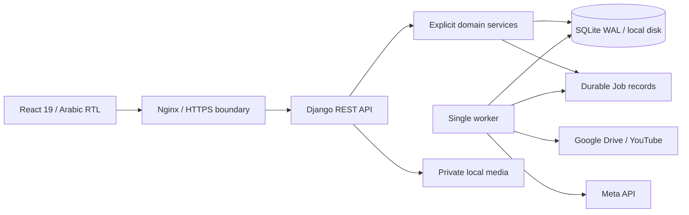

# Architecture

CreativeManager is a same-origin SPA backed by Django session authentication. Browser mutations require CSRF. The server verifies workspace membership and brand scope on both object queries and submitted relation IDs.

Bounded apps: accounts, workspaces, catalog, requests_app, creatives, storage, integrations, performance, experiments, automations, context_hub, notifications, audit and common. `common/resources.py` is an explicit public API registry; adding a Django model does not automatically expose it. Shared serializers validate relationships; state-changing business behavior lives in service modules.

All external provider calls occur outside database transactions. Short transactions persist claims, transitions and receipts. SQLite uses WAL, a 20-second busy timeout and IMMEDIATE transactions. This is intended for a small internal team with one worker on local persistent storage. PostgreSQL migration would replace settings and the isolated backup adapter; domain code uses ORM.

The queue interface is `enqueue`, `claim`, `handle`, and `run_once`. Handlers are allow-listed. Claim updates are atomic, stale leases recover after ten minutes, and retry delays grow exponentially to one hour. Meta publication uncertainty requires reconciliation instead of automatic retry.

Audit and activity are separate records. APIs and the emergency admin do not permit editing/deleting audit history. The database administrator remains a trusted operator; database-level tamper-proof storage is not claimed.

Public codes use a year plus a random ten-character suffix instead of sequential counters, avoiding extra write contention. UUIDs are authoritative keys. Previous approved versions remain available when a new version is created.

The frontend uses a shared schema-driven editor for supporting resources and focused screens for requests, creative work/review, the board, library, evidence and authentication. React Query stores server state; no authentication token is stored in localStorage. Only locale preference is stored there.
