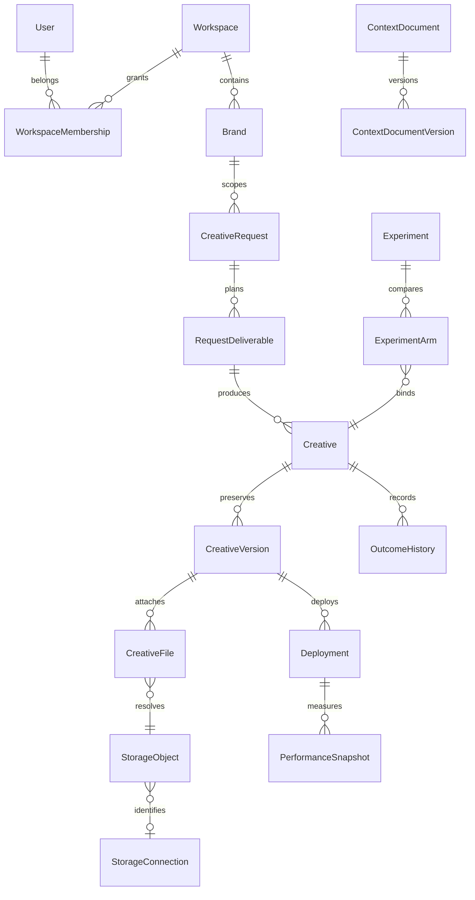

# Domain model

Every business row carries workspace and, where applicable, brand. Foreign keys use PROTECT to preserve history. Unique constraints protect memberships, deliverable sequence, creative/context version numbers, provider object identity, experiment bindings, performance windows and automation execution keys.

Creative is the central identity. A version is a revision artifact. A deployment records a use of an approved version on a platform. A related creative is a different creative with a documented hypothesis; it is not another version number.

Local media is private and never served by an unauthenticated media URL. CreativeFile joins a version to a StorageObject and role. Publishing resolves exactly one active master of an approved version. Drive copies of already-approved local masters are attached as exports, preserving historical master identity.

Snapshots are immutable through the API. Zero-denominator metrics are null. Currency and window compatibility are required for fatigue comparisons; the evidence screen shows observation counts and latest observation windows instead of summing overlapping snapshots.
