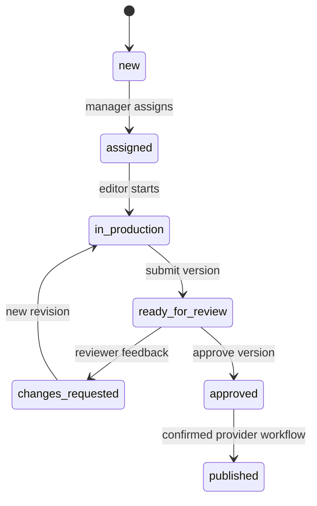
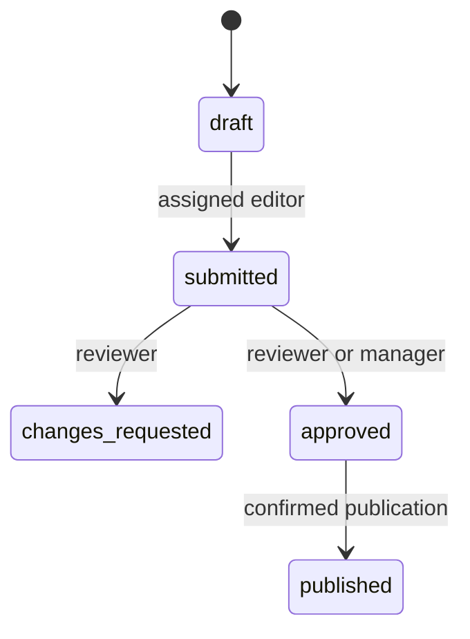

# Workflows

Request status is a rollup across deliverables/creatives. Approving one sibling cannot approve unfinished siblings. Core UI journey: requester creates a request and deliverables; manager assigns; editor creates a creative and draft; editor uploads the master and submits; reviewer requests changes or approves. Changes require feedback. A revision gets a new number; the old record remains.

The publication receipt is authoritative for external deployment success. A confirmed Meta or YouTube publication marks its approved version published, updates the current creative when applicable and recomputes request/deliverable status. Publishing an older approved version does not overwrite a newer current revision. Deployment state and provider privacy still matter: a paused Meta ad or private YouTube video is not publicly live.

Experiments start only with at least two arms and exactly one control. Arms cannot be changed after starting. Completion requires a learning; conclusions must state limitations. Context edits create new versions; approved historical content cannot be overwritten.

Automation actions are limited to notifying an owner or proposing a refresh. Rules cannot evaluate arbitrary code or trigger publication. The worker executes each rule/event pair at most once. Run `scan_deadlines` on a schedule for due-soon/overdue notifications.
